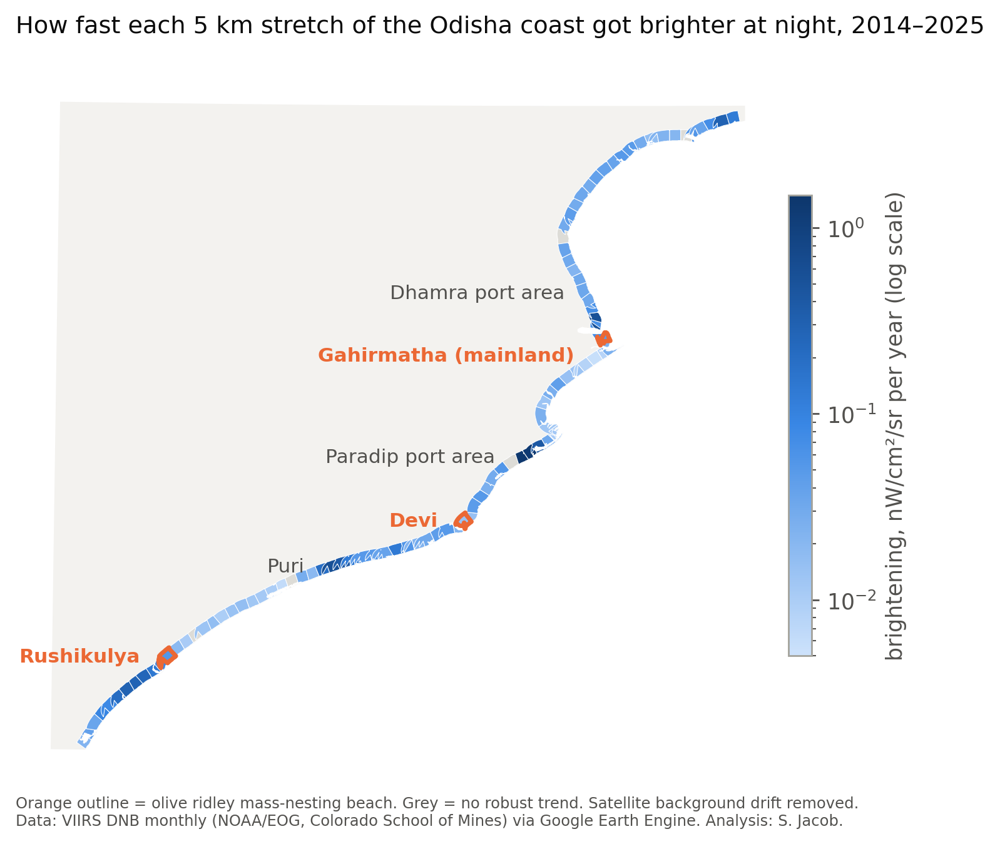
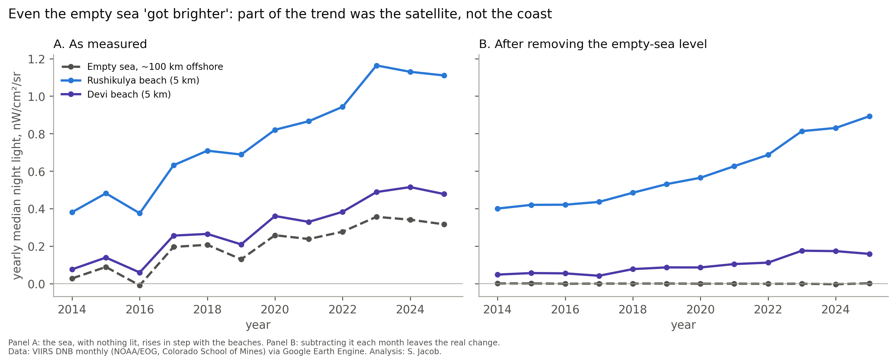
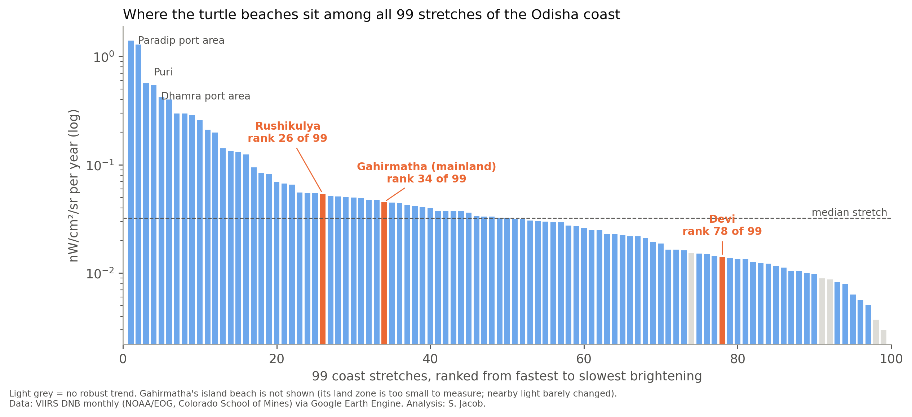
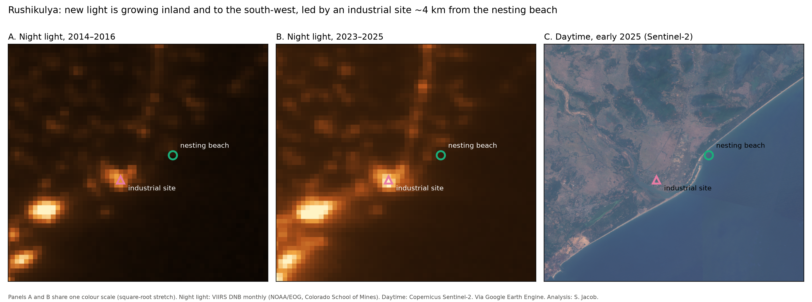

# Dark Skies for Hatchlings 🐢🌙
**Are the olive ridley turtle nesting beaches of Odisha, India getting brighter at night? A satellite night-light study, 2014–2025.**



## In short
- Night light rose along almost the whole Odisha coast between 2014 and 2025 (94 of 99 five-km stretches show a robust increase after removing sensor drift).
- Of the three mass-nesting beaches, **Rushikulya** sits at the edge of a brightening zone: the strongest new light is inland and to the south-west, led by an industrial site about 4 km from the river mouth.
- **Gahirmatha's** main nesting beach (Abdul Kalam Island) stayed dark; the largest increase in that area is at Dhamra port, about 15 km away. **Devi** changed about as slowly as the dark countryside.
- A methodological lesson: even empty sea 100 km offshore "got brighter" in the raw data. Without correcting for that, every beach would have looked 3–5 times brighter.

These are measurements of light going **up into space**. They are a proxy for light pollution, not a measure of harm to hatchlings.

## Why it matters
Sea turtle hatchlings emerge at night and crawl towards the brightest, lowest horizon, which on a natural beach is the sea. Artificial light can pull them inland, where many die. Odisha hosts three of the world's largest olive ridley *arribadas* (mass-nesting events): Gahirmatha, Devi river mouth and Rushikulya. Because hundreds of thousands of eggs hatch on a few kilometres of sand within a few nights, a single nearby light source can affect a large share of a year's hatchlings. Field work at Rushikulya has already shown that lights from villages, a highway and a factory misorient hatchlings (Karnad et al. 2009).

## Question
Between 2014 and 2026, did night light around Odisha's three mass-nesting beaches change by more than the sensor's noise, how does that compare with the rest of the Odisha coast, and is the change different in the nesting and hatching months (February–May)?

## Data
| Data | Source | Use |
|---|---|---|
| VIIRS Day/Night Band monthly composites, Jan 2014–Aug 2026, ~460 m | NOAA / Earth Observation Group, Colorado School of Mines (`NOAA/VIIRS/DNB/MONTHLY_V1/VCMSLCFG`, Google Earth Engine) | Main time series |
| VIIRS annual composites V2.1 (2013–2021) and V2.2 (2022–2025) | Same producer (`ANNUAL_V21`, `ANNUAL_V22`) | Independent cross-check; 2013 "unlit" mask |
| MODIS land/water mask (MOD44W, 250 m) | NASA LP DAAC | Land vs sea pixels |
| Large Scale International Boundaries (LSIB 2017) | US Department of State (public domain) | Coastline |
| Sentinel-2 imagery; Dynamic World land cover | Copernicus / ESA; Google & World Resources Institute (CC BY 4.0) | Daytime ground checks |
| Nesting beach locations | Hand-compiled from published sources ([data/sites/nesting_sites.csv](data/sites/nesting_sites.csv)) | Three well-known public sites, ~1 km precision |

**On locations:** the SWOT sea turtle database restricts its site data to approved users, which is a sensible protection. This project only uses the three mass-nesting beaches whose locations are already widely published, at about 1 km precision, and adds no new or finer nest locations.

## Method (plain version)
1. **Where:** circles of 1, 5 and 10 km around each nesting beach, and the whole coast cut into 99 stretches of 5 km (land within 5 km of the shore).
2. **What:** the average night light in every region, every month from 2014.
3. **Cleaning:** months with fewer than 3 cloud-free nights were dropped (mostly the June–September monsoon). A value of 0 in a cloudy month means "no data", not darkness.
4. **Sensor drift:** three boxes of open sea ~100 km offshore, where nothing is lit, rose by ~0.3 nW/cm²/sr over the period and moved in step with every beach. Each month, their average was subtracted from every region.
5. **Trend:** Theil–Sen slope (the median of the slopes between all pairs of years, so one odd year can't drive it) and a Mann–Kendall test. A trend counts as **robust** only if p < 0.05 **and** the slope is larger than in 95% of 30 empty-sea locations of the same size (the noise floor).
6. **Checks:** circle size (1, 5, 10 km), NOAA's independent annual product, and daytime satellite images.



## Findings (hedged)


- **Coast-wide brightening.** 94 of 99 stretches show a robust increase. The median stretch brightened by about 0.03 nW/cm²/sr per year. The fastest stretches lie around the Paradip port area, Puri and the Dhamra port area.
- **Rushikulya (rank 26 of 99).** Brightening is strongest to the south-west and fades north-east along the nesting beach (stretch ranks 10, 13, 18, 26, then 69 and 88 going north). The largest local increase (about +10 nW/cm²/sr between 2014–16 and 2023–25) is at an industrial site about 4 km from the river mouth. Its built-up footprint grew only slightly (about 1.03 → 1.14 km², Dynamic World), which is consistent with more or brighter lighting on a similar footprint. We cannot see lamp type, direction or shielding from space.

  

- **Gahirmatha.** The island nesting beach stayed essentially dark (increase within 5 km about the size of the sensor background). The largest increase nearby (about +19 nW/cm²/sr) is at Dhamra port, ~15 km north. Whether that glow is visible from the beach at hatchling eye level can only be answered on the ground.
- **Devi (rank 78 of 99).** Changed at about the same rate as dark, unlit countryside.
- **Nesting season.** Nesting months (Feb–May) brightened faster than the off-season (Oct–Jan) at Gahirmatha's mainland stretch, but the same pattern appears in 57 of 99 stretches, so it is probably a coast-wide effect (e.g. seasonal fires or haze), not something specific to turtle beaches.
- **Cross-check.** NOAA's annual product ranks the 99 stretches in almost the same order (Spearman ρ = 0.96).

## Limitations
- **Blind to blue light.** The VIIRS Day/Night Band barely sees wavelengths below ~500 nm. White LEDs emit much of their light there, and turtles are most sensitive to it. A beach switching to LEDs can look *dimmer* from space while getting worse for hatchlings (Kyba et al. 2023).
- **Pixels vs beaches.** A ~460 m pixel is much wider than a beach, and light blurs into neighbouring pixels.
- **One snapshot a night**, around 01:30 local time; lights switched off earlier are missed.
- **Upward light, not horizon glow.** Hatchlings respond to glow on the horizon; the satellite measures light escaping upwards. Shielding and direction are invisible.
- **No outcome data.** Nothing here measures hatchling disorientation or deaths.
- **Monsoon gaps.** June–September is mostly cloud-covered.
- **Lenient noise floor.** Open sea is quieter than land, so "robust" means "beyond sensor noise", not "large".
- **Sensor drift correction** assumes the offshore level applies everywhere; the annual product supports the ranking but not every exact value.
- **Coast ends.** One or two stretches at each end may lie just outside Odisha.

## What didn't work
- SWOT nesting-site data could not be downloaded without provider permission, so a hand-made list was used.
- Dataset catalogue pages listed the wrong years for the annual composites; checking in code was necessary.
- The coastline outline omits Abdul Kalam Island, so a land-only mask could not be used for Gahirmatha.
- Dynamic World does not label port yards as "built", so it could not measure port growth.

## Next steps
- Share with local groups and ask what would make this useful.
- Ground measurements of horizon brightness at the beaches during hatching.
- Higher-resolution or colour night imagery (e.g. astronaut photos, SDGSAT-1) to address the LED blind spot.
- Automated yearly updates; shoreline change and sand temperature as further threats.

## Reproduce
```
py -m venv .venv
.\.venv\Scripts\Activate.ps1
pip install -r requirements.txt
earthengine authenticate
copy .env.example .env   # set EE_PROJECT
python scripts/00_check_setup.py    # then 01 ... 10 in order (run 05 again after 06)
```
`data/raw`, `data/processed` and `papers/` are not in the repo; the scripts regenerate the data.

## Key references
- Hu, Hu & Huang (2018) *Environmental Pollution* 239:30–42. doi:10.1016/j.envpol.2018.04.021
- Karnad et al. (2009) *Biological Conservation* 142:2083–2088. doi:10.1016/j.biocon.2009.04.004
- Kamrowski et al. (2014) *Global Change Biology* 20:2437–2449. doi:10.1111/gcb.12503
- Leader, Levy & Türkozan (2024) *Turkish Journal of Zoology* 48:203–210. doi:10.55730/1300-0179.3176
- Shanker, Pandav & Choudhury (2004) *Biological Conservation* 115:149–160. doi:10.1016/S0006-3207(03)00104-6
- Behera et al. (2016) *Indian Journal of Geo-Marine Sciences* 45(2):233–238
- Elvidge et al. (2017) *Int. J. Remote Sensing* 38:5860–5879; Elvidge et al. (2021) *Remote Sensing* 13:922
- Kyba et al. (2023) *Science* 379:265–268. doi:10.1126/science.abq7781

## Credits
VIIRS night lights: Earth Observation Group, Payne Institute, Colorado School of Mines. Contains modified Copernicus Sentinel data. Dynamic World: Google and World Resources Institute (CC BY 4.0).
Code written with the help of an AI assistant; questions, decisions and interpretation are mine. — Siddhant Jacob
Licence: MIT (code).
